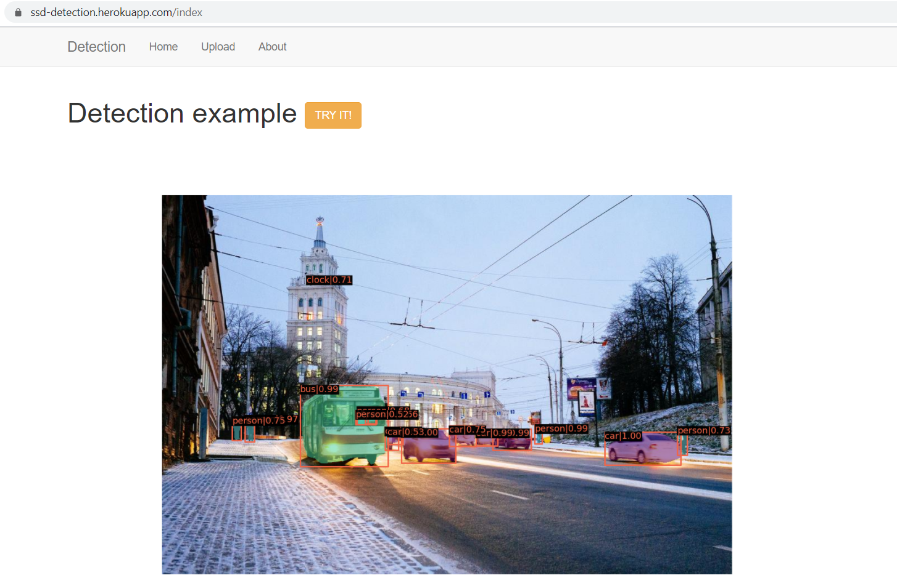
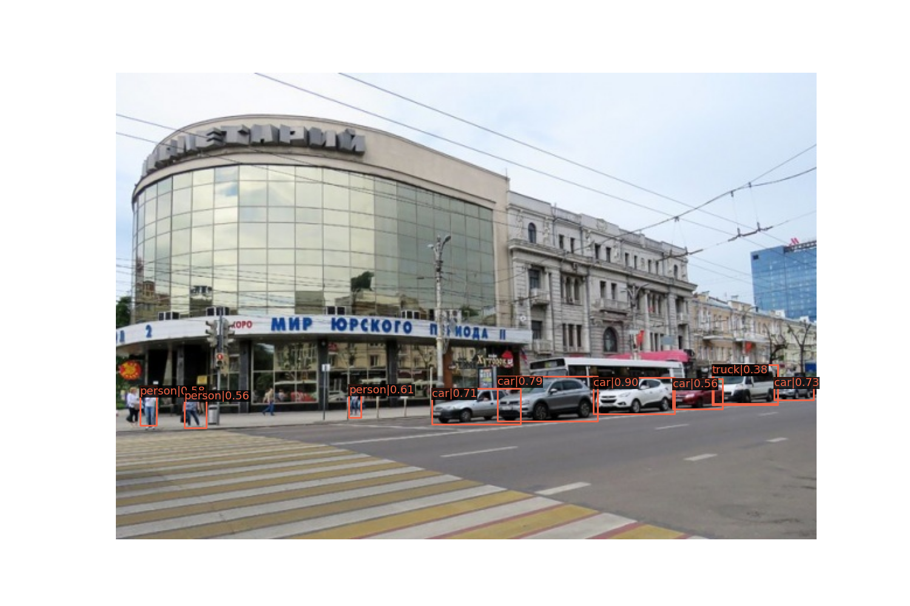
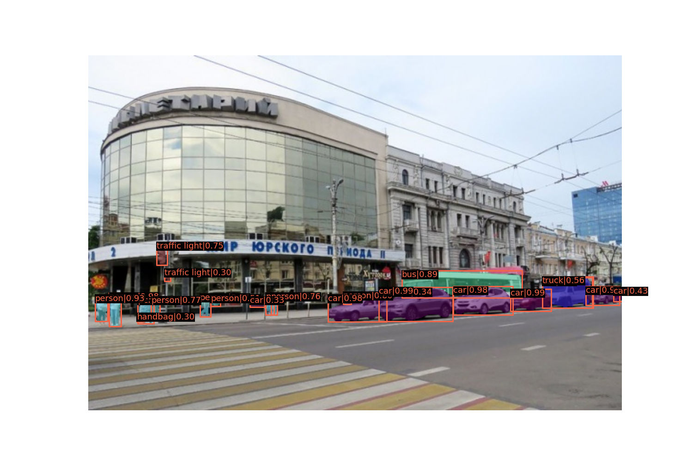
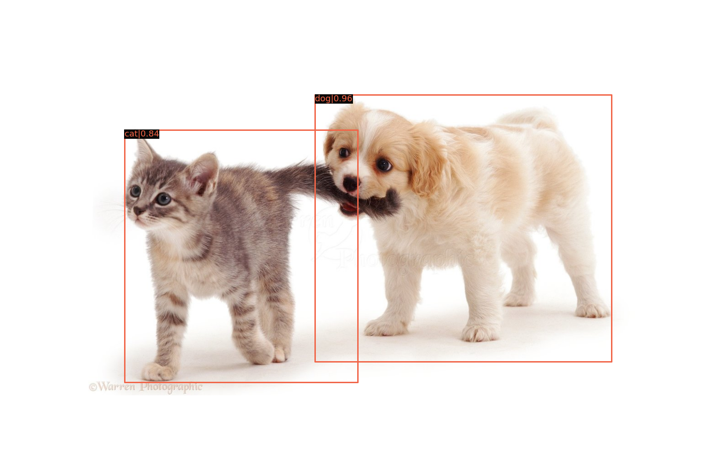
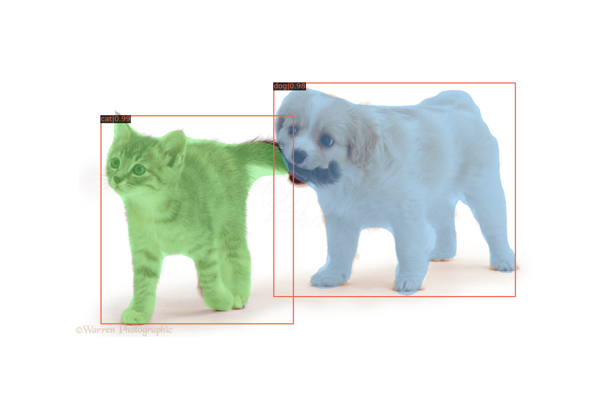
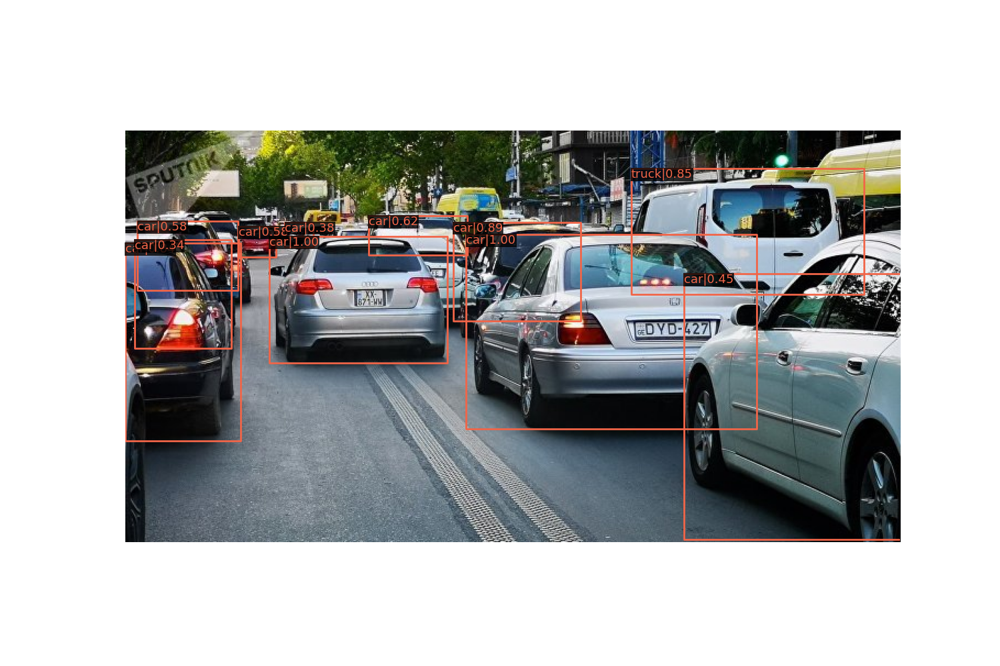
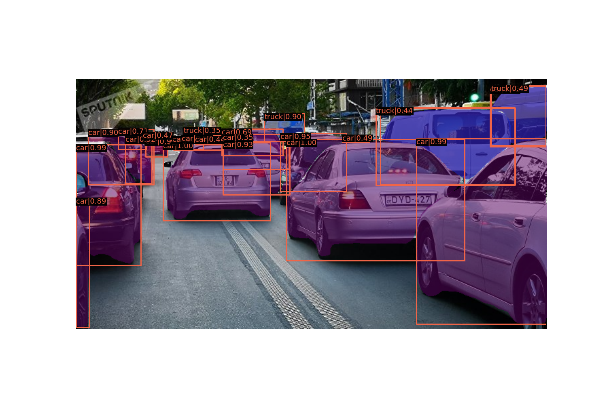

# Веб-приложение - детекция с помощью нейросетей SSD и MaskRCNN

## Ссылка на демонстрацию

https://ssd-detection.herokuapp.com/

Первая загрузка приложения может занимать время из-за особенностей Heroku

## Технологии

- **mmdetection**
    В качестве фреймворка для детектора была выбран <a href="https://github.com/open-mmlab/mmdetection"> mmdetection </a>

    К преимуществам относится простота использования:

    - Не нужно подготавливать изображение, достаточно указать путь к нему
    - Не требуется дополнительные настройку для использования на cpu
    - Тривиальная загрузка моделей

    К недостатком - сложность установки и развертывания на хостинге

- **Flask**

    Для веб-части выбран микрофреймворк Flask, так как он прост и легок в изучении

- **Flask-Bootsrap**

    Для создания элементов интерфейса

- **Heroku**

    Для размещения демо выбран сервис <a href="https://www.heroku.com/"> Heroku </a>

    К преимуществам относятся:

    - Доступность без привязки к "кошельку"
    - Легкость развертывания Python-приложения с помощью Git
    - Расширения позволяющее добавлять различные ф-и, например, развертывание Docker контейнеров

    К недостаткам:

    - Проблемы с установкой требований (зависимостей) при развертывании из Git
    - Ограничения в 512 Mb RAM

## Описание

Приложение позволяет загрузить картинку, выбрать точность детекции и получить результат

## Структура

При нажатии кнопки загрузки изображения, оно сохраняется на сервер и ему присваивается уникальное кодовое имя.

Как только изображение загружено из javascript вызывается api для детекции на сервере.

Такой подход называется Ajax. При этом во время детекции отображается gif загрузки, а как только детекция завершена
показывается результат.

После детекции результат сохраняется в output_<уникальное имя>.png

В качестве сети для детекции используется ssd300 предобученную на датасете COCO, локально использовалась MaskRCNN,
но она не влезла в ограничения Heroku

Развертывание приложения производилось с помощью Docker. В Dockerfile описан процесс установки зависимостей,
за основу взят контейнер python:3

## Тестирование моделей
Оценим качество SSD модели на практике, сравнив ее с MaskRCNN

SSD

MaskRCNN

Здесь SSD не распознает некоторых людей и машины

SSD

MaskRCNN

Однако с крупными объектами SSD справляется довольно хорошо, причем, на мой взгляд, граничные рамки точней чем у
MaskRCNN

SSD

MaskRCNN

Здесь SSD тоже не может распознать машины вдали.

Для улучшения качества SSD в конкретных ситуациях, нужно добучать или обучать модель с нуля на определенном датасете,
например, машины и люди. Для SSD сделать это горазда легче и быстрей, чем для MaskRCNN

## Примечание

Самым сложным этапом проекта стала установка библиотеки mmdetection сначала локально, а потом на сервисе Heroku. За это
время, как мне показалось, я собрал все возможные ошибки и проблемы установки зависимостей, зато удалось
поближе познакомиться с Docker и некоторыми особенностями Python и Heroku.

Поэтому не удалось разобраться с асинхронной обработкой и обучить SSD хоть на каком-то датасете.